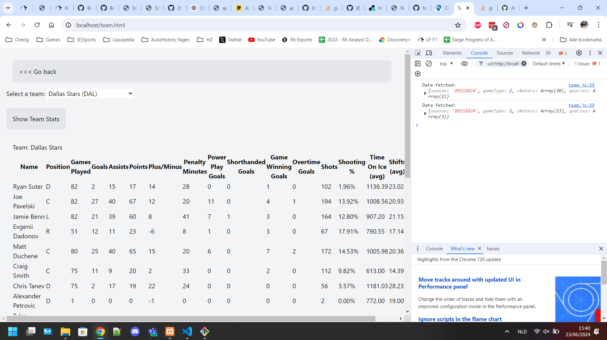
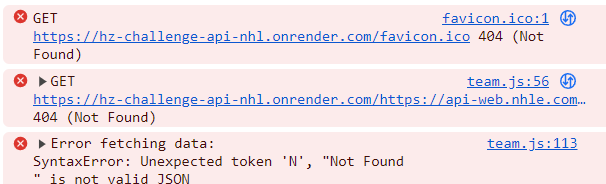

De pagina werkt eindelijk op render, gebruik deze link: https://hz-challenge-api-nhl-v2.onrender.com/ 
Voor mijn eigen github repo ga naar deze link: https://github.com/Okidokie98/hz-challenge-api-nhl

Tenopzichte van het orginele design heb ik de logo's niet meer gerenderd, deze zitten niet in de API dus dan had ik ze handmatig moeten toevoegen.

De 4 knoppen op de hoofdpagina zijn nog steeds conform het design

---------------------------------------------------------------

API Info: https://github.com/Zmalski/NHL-API-Reference

This app has been made by: Brandon "Okidokie98" de Baat

How to use this app ("..." are terminal commands):
- Clone the repo
- "npm install"
- "node proxy-server.js" (starts a proxy on localhost::8000)
- Start your XAMP server

Zodra de app opgestart is dan kan je naar de Teams pagina gaan, een team selecteren en de resultaten zien.

Dit is wat je te zien zou moeten krijgen.
! "node proxy-server.js" moet runnen in je terminal anders werkt het niet, excuses voor het ongemak.

Ik heb geprobeerd om de website te hosten op Render: https://hz-challenge-api-nhl.onrender.com/index.html

Maar ik kreeg elke keer deze error, ook nadat ik de URL start had aangepast... 