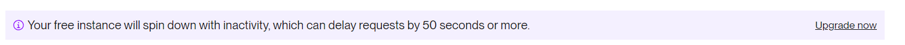

Ik heb na poging 1 alle code opnieuw op render gezet en een kleine aanpasing gedaan, door van een "Static Website" naar een "Web Service" te gaan kon ik een "start" command toevoegen die mijn proxy kan activeren, waardoor nu wel alles werkt 😁

De pagina staat dus ook gehost op render.com, gebruik deze link: https://hz-challenge-api-nhl-v2.onrender.com/index.html (Het kan zijn dat het laden op render wel lang duurt omdat ik een gratis versie heb) 

Voor mijn eigen github repo ga naar deze link: https://github.com/Okidokie98/hz-challenge-api-nhl

Tenopzichte van het orginele design heb ik de logo's niet meer gerenderd, deze zitten niet in de API dus dan had ik ze handmatig moeten toevoegen.

De 4 knoppen op de hoofdpagina zijn nog steeds conform het design

Op de team pagina was mijn orginele idee om enkel de lijst van één team (Nashville Predators) te laten zien, dit heb ik
veranderd naar een pagina met een dropdown waarin je zelf een team naar keuze kan selecteren.
Deze zal dan een lijst met statestieken van de spelers geven, enkel de gegevens van het huidige seizoen (2023-2024) en uit het
reguliere seizoen (dus zonder de "Stanley Cup Playoffs") worden opgehaald met de API.

Hieronder staat de orginele tekst zoals ingestuurd voor poging 1:

---------------------------------------------------------------

API Info: https://github.com/Zmalski/NHL-API-Reference

This app has been made by: Brandon "Okidokie98" de Baat

How to use this app ("..." are terminal commands):
- Clone the repo
- "npm install"
- "node proxy-server.js" (starts a proxy on localhost::8000)
- Start your XAMP server

Zodra de app opgestart is dan kan je naar de Teams pagina gaan, een team selecteren en de resultaten zien.

Dit is wat je te zien zou moeten krijgen.
! "node proxy-server.js" moet runnen in je terminal anders werkt het niet, excuses voor het ongemak.

Ik heb geprobeerd om de website te hosten op Render: https://hz-challenge-api-nhl.onrender.com/index.html

Maar ik kreeg elke keer deze error, ook nadat ik de URL start had aangepast... 